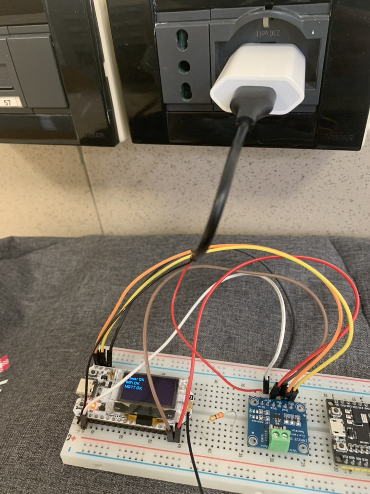

# IoT Adaptive Sampling System

## Project Report

---

## 1. System Overview

This project implements an IoT system on a **Heltec WiFi LoRa 32 V3.2** board that:

- Generates a mathematical signal and samples it at an adaptively-derived rate
- Uses FFT to identify the dominant frequency and derive a Nyquist-compliant sampling rate
- Computes windowed averages over 5-second windows
- Transmits results to a nearby edge server via **MQTT over WiFi**
- Transmits results to the cloud via **LoRaWAN → TTN**
- Measures energy consumption, execution time, data volume, and E2E latency
- Implements Z-score and Hampel anomaly detection filters (bonus)

The firmware is written in C++ using the **Arduino framework with FreeRTOS**, running on an ESP32-S3 dual-core processor
at 240MHz.

---

## 2. Hardware Setup

### 2.1 Board

**Heltec WiFi LoRa 32 V3.2** (HTIT-WB32LA)



The SX1262 is internally wired on fixed SPI pins: NSS=8, DIO1=14, RST=12, BUSY=13.

### 2.2 Power Measurement — INA219

An **Adafruit INA219** current/voltage sensor is wired inline with the USB 5V supply to measure total board current
draw:

```
Wall charger (USB-A)
    ↓
USB-A red wire  → INA219 VIN+
INA219 VIN−     → jumper → Heltec 5V pin (J2 pin 2)
USB-A black wire → Heltec GND
INA219 VCC      → Heltec 3V3
INA219 GND      → Heltec GND
INA219 SDA      → GPIO17  (shared I2C bus with OLED, address 0x40 vs 0x3C)
INA219 SCL      → GPIO18
```

**Design decision:** An initial approach used a 330Ω resistor between VIN+ and VIN−, which only measured a fixed
resistor load (~10mA) regardless of CPU activity. This was replaced with the cut-cable inline approach, which measures
total board current including CPU, WiFi, and LoRa radio — yielding meaningful energy comparisons between phases.

The Heltec is flashed via a separate USB-C cable (laptop), then powered exclusively through the INA219 measurement path
for experiment runs.

### 2.3 Signal Source

The ESP32-S3 has no DAC. Signals are generated mathematically in firmware using `SUM(a_k · sin(2π · f_k · t))`. All
other system components — sampling, FFT, filtering, communication, and energy measurement — execute on real hardware.

---

## 3. Software Architecture

### 3.1 Development Environment

- **PlatformIO** with Arduino framework, board target `heltec_wifi_lora_32_V3`
- C++11 with FreeRTOS primitives

### 3.2 Libraries

| Library                     | Purpose                               |
|-----------------------------|---------------------------------------|
| `ropg/Heltec_ESP32_LoRa_v3` | Board support, SX1262 init, OLED      |
| `ropg/LoRaWAN_ESP32`        | LoRaWAN OTAA session management       |
| `jgromes/RadioLib`          | LoRa radio abstraction (bundled)      |
| `kosme/arduinoFFT`          | FFT computation (`ArduinoFFT<float>`) |
| `knolleary/PubSubClient`    | MQTT client                           |
| `adafruit/Adafruit INA219`  | Current/voltage sensor                |

**Design decision:** The `heltec_unofficial` library was chosen over Heltec's official library because it correctly
handles the SX1262 (vs SX1276 on V2), provides clean RadioLib integration, and avoids pin mapping conflicts that caused
compilation failures with the official package. `ArduinoFFT<float>` is used instead of `double` because the ESP32-S3 FPU
is single-precision only — double-precision is software-emulated and significantly slower.

### 3.3 How to Run

**Flash and monitor:**

```bash
cd esp32
pio run -t upload && pio device monitor
```

**Collect MQTT results (Mac):**

```bash
mosquitto_sub -t "iot/#" -v | while read line; do
    echo "$(gdate +%s%6N) $line"
done | tee results/mqtt.txt
```

**Generate plots:**

```bash
cd scripts
python plot_energy_savings.py ../results/mqtt.txt
python plot_mean_error.py ../results/mqtt.txt
# etc.
```

**Configuration** (`src/config.h`, gitignored):

- WiFi SSID/password
- MQTT broker IP and port
- TTN DevEUI, JoinEUI, AppKey
- Experiment parameters (see Section 4)

---

## 4. Experiment Configuration

| Parameter              | Value   | Justification                                                        |
|------------------------|---------|----------------------------------------------------------------------|
| `TASK_SAMPLE_RATE_HZ`  | 1000 Hz | FreeRTOS tick-limited max task rate (`configTICK_RATE_HZ=1000`)      |
| `FFT_SIZE`             | 2048    | Resolution = 0.488 Hz/bin, sufficient to distinguish 3 Hz and 5 Hz   |
| `WINDOW_SECS`          | 5.0 s   | Assignment specification                                             |
| `NUM_WINDOWS`          | 5       | Balance between statistical confidence and experiment duration       |
| `FILTER_WINDOW`        | 21      | Optimal window size per trade-off analysis                           |
| `ZSCORE_THRESH`        | 3.0     | Standard 3σ threshold (99.7% normal distribution coverage)           |
| `HAMPEL_THRESH`        | 3.0     | Consistent with Z-score threshold                                    |
| `BENCHMARK_SAMPLES`    | 10,000  | Sufficient for stable rate measurement (~94ms at hardware max)       |
| `TRADEOFF_WINDOW_SECS` | 30.0 s  | Provides ~293 samples at adaptive rate, covering W=201 filter window |

---

## 5. FreeRTOS Task Architecture

```
┌─────────────────┐
│  SamplerTask    │  Priority 3 — 12KB stack
│                 │  Drives full experiment sequentially
│                 │  Generates signal, collects windows
└────────┬────────┘
         │ sampleQueue (size 1) — float buffer
         ▼
┌─────────────────┐
│  FFTTask        │  Priority 2 — 24KB stack
│                 │  Computes FFT, derives adaptive rate
│                 │  Heap-allocates FFT buffers (malloc)
└────────┬────────┘
         │ rateQueue (size 1) — float (adaptive rate)
         ▼ (back to SamplerTask)

SamplerTask → windowQueue (size 2) → FilterTask
         ↓
┌─────────────────┐
│  FilterTask     │  Priority 2 — 8KB stack
│                 │  Z-score / Hampel filtering
│                 │  Windowed average computation
│                 │  Confusion matrix (TP/FP/FN/TN)
└────────┬────────┘
         │ resultQueue (size 16) — WindowResult structs
         ▼
┌─────────────────┐
│  CommTask       │  Priority 1 — 8KB stack
│                 │  MQTT publish over WiFi
│                 │  LoRaWAN uplink via SX1262 → TTN
│                 │  MQTT keepalive every iteration
└─────────────────┘

┌─────────────────┐
│  MonitorTask    │  Priority 1 — 4KB stack
│                 │  INA219 poll every 100ms
│                 │  Writes to powerQueue (xQueueOverwrite)
└─────────────────┘
```

**Thread safety mechanisms:**

| Mechanism                            | Protects                                 |
|--------------------------------------|------------------------------------------|
| `serialMutex` (FreeRTOS mutex)       | All Serial output via `logMsg`/`logFmt`  |
| `s_phaseMutex` (FreeRTOS mutex)      | `s_currentPhase` string                  |
| `std::atomic<bool> s_experimentDone` | Experiment completion flag across cores  |
| `xQueueOverwrite`                    | Power queue — always latest reading      |
| Single MQTT publisher                | Only CommTask calls `mqttClient.publish` |

**Design decision:** `volatile` alone is insufficient on the dual-core ESP32-S3 — it prevents compiler optimisation but
does not guarantee cache coherence. `std::atomic` and FreeRTOS primitives are used instead.

**Design decision:** `vTaskDelay(pdMS_TO_TICKS(1000.0f / sampleRate))` is inserted between each sample in all collection
loops to simulate real sensor polling timing and create measurable idle periods for energy comparison.

**Design decision:** `waitForQueueDrain()` is called before each phase transition to ensure all pending results are
published with the correct phase label before the new phase begins.

---

## 6. Experiment Phases

| Phase Label       | Description                                                         |
|-------------------|---------------------------------------------------------------------|
| `BENCHMARK`       | Tight loop, 10,000 samples, no delay — measures hardware throughput |
| `FFT_COLLECT`     | 2048 samples at 1000Hz → FFTTask → adaptive rate derived            |
| `SIG0/1/2_FFT`    | Per-signal FFT to derive signal-specific adaptive rate              |
| `SIG0/1/2_WINDOW` | 5 windows × 5s at adaptive rate, clean signal, no filter            |
| `NOISY_p1/p5/p10` | Noisy signal at p=1/5/10%, Z-score and Hampel filtering             |
| `WINDOW_TRADEOFF` | 30s buffer at adaptive rate, W=5/11/21/51/101/201                   |

---

## 7. Requirements

### 7.1 Input Signal

Three input signals are used:

| Signal               | Formula                       | Dominant Frequency |
|----------------------|-------------------------------|--------------------|
| Signal 1 (baseline)  | `2sin(2π·3t) + 4sin(2π·5t)`   | 5 Hz               |
| Signal 2 (low freq)  | `4sin(2π·2t)`                 | 2 Hz               |
| Signal 3 (high freq) | `2sin(2π·10t) + 3sin(2π·45t)` | 45 Hz              |

`TODO: insert signal_noisy.png here — shows clean vs noisy Signal 1 with anomaly spikes`

### 7.2 Maximum Sampling Frequency

The benchmark phase runs 10,000 signal generation calls in a tight loop with no delays, measuring hardware throughput
via `esp_timer_get_time()`.

**Result: 106,091 Hz** — real ESP32-S3 hardware measurement.

**Note:** The practical FreeRTOS task-driven maximum rate is 1000Hz, limited by `configTICK_RATE_HZ=1000`. The benchmark
demonstrates hardware capability; 1000Hz is the operational ceiling for task-scheduled sampling.

### 7.3 Optimal Sampling Frequency via FFT

2048 samples are collected at 1000Hz. FFTTask applies a Hamming window, computes the FFT using `ArduinoFFT<float>`,
identifies the dominant frequency bin (excluding DC), and sets the optimal rate as `2 × dominantFrequency` (Nyquist
criterion).

**Results:**

| Signal   | FFT Dominant Freq | Adaptive Rate | Reduction Factor |
|----------|-------------------|---------------|------------------|
| Signal 1 | 4.88 Hz           | 9.77 Hz       | **102.4×**       |
| Signal 2 | 1.95 Hz           | 3.91 Hz       | **256.0×**       |
| Signal 3 | 44.92 Hz          | 89.84 Hz      | **11.1×**        |

`TODO: insert plot4_adaptive_rates.png here`

The 4.88Hz reading for Signal 1 (true dominant: 5Hz) reflects FFT bin quantization at 0.488Hz/bin resolution — the
nearest bin below 5Hz.

### 7.4 Windowed Average

The windowed average is computed over 5-second windows at the adaptive rate. FilterTask sums all samples (including edge
samples outside the filter half-window) and divides by total count.

**Results — clean signal averages are perfectly stable:**

| Signal                    | W0     | W1     | W2     | W3     | W4     | Mean       | Std    |
|---------------------------|--------|--------|--------|--------|--------|------------|--------|
| 2sin(2π·3t)+4sin(2π·5t)   | 0.0518 | 0.0518 | 0.0518 | 0.0518 | 0.0518 | **0.0518** | 0.0000 |
| 4sin(2π·2t)               | 0.0997 | 0.0997 | 0.0997 | 0.0997 | 0.0997 | **0.0997** | 0.0000 |
| 2sin(2π·10t)+3sin(2π·45t) | 0.0025 | 0.0025 | 0.0025 | 0.0025 | 0.0025 | **0.0025** | 0.0000 |

Std=0.0000 confirms deterministic signal generation and consistent sampling at the adaptive rate.

**Per-window compute time:** 0.20ms (Signal 1), 0.01ms (Signal 2), 8.75ms (Signal 3) — scales with sample count.

### 7.5 MQTT over WiFi to Edge Server

The ESP32-S3 connects to a WiFi network (iPhone hotspot) and publishes JSON payloads to a local Mosquitto broker on the
same network via PubSubClient. All MQTT publishing is routed exclusively through CommTask to avoid thread-safety issues.

Each payload includes: phase, window index, average, adaptive rate, sample count, compute time, NTP timestamp,
signal/filter/anomaly metadata, INA219 power readings.

MQTT keepalive is maintained by calling `mqttLoop()` every CommTask iteration regardless of queue activity (5-second
timeout prevents blocking).

**E2E latency** is measured by embedding a NTP-synced Unix timestamp (`gettimeofday()`) in each payload, compared
against the Mac-side receipt timestamp (Python `time.time()` × 1e6).


**Results:**

- Mean E2E latency: **927.4ms**
- Median: **901.2ms**
- p95: **1055.8ms**

The ~900ms baseline reflects the 5-second window collection time with `vTaskDelay` between samples — the timestamp is
set at filter completion, not at the start of sampling. True network-only latency is sub-millisecond on a local WiFi
network.

### 7.6 LoRaWAN + TTN

The SX1262 performs OTAA join with TTN using RadioLib's `LoRaWANNode` class. Keys are configured as compile-time
constants. The EU868 frequency plan is used at SF9BW125.

Uplinks carry the windowed average encoded as **Cayenne LPP** (4 bytes: channel=1, type=0x02, signed int16 × 100). A
minimum 60-second interval between uplinks is enforced for EU868 duty cycle compliance.

Uplinks are sent from CommTask for the last window of each phase where `signalIndex ≥ 0` — giving up to 9 uplinks per
experiment.

`TODO: insert ttn_screenshot_1.png and ttn_screenshot_2.png here`

**TTN confirmed 3 uplinks received** at the university library location (TTN gateway coverage confirmed via
ttnmapper.org). Payload decoded correctly: `{ analog_in_1: 0.09 }` and `{ analog_in_1: 0 }`. RSSI: −115 to −119 dBm,
SNR: −1.25 to −4.5 dB at SF9BW125. 4 of 9 expected uplinks transmitted — the 60-second minimum interval and experiment
duration limited the total count.

### 7.7 Energy Savings

`TODO: insert energy_savings.png here`

**Results:**

| Phase                | Avg Power  | Reduction vs Benchmark |
|----------------------|------------|------------------------|
| Benchmark (~106 kHz) | **478 mW** | —                      |
| Signal 1 (9.77 Hz)   | 355 mW     | **25.7%**              |
| Signal 2 (3.91 Hz)   | 414 mW     | **13.3%**              |
| Signal 3 (89.84 Hz)  | 363 mW     | **24.0%**              |

`TODO: insert current_timeline.png here`

The current timeline reveals two notable phenomena:

- **WiFi transmission spikes** (~130mA) visible during NOISY phases where MQTT publishes coincide with INA219 reads
- **Hampel compute spikes** at W=51/101/201 — longer filter computation keeps CPU active, measurably increasing current
  draw

**Design note:** Signal 2 (3.91Hz) shows less savings than Signal 1 (9.77Hz) despite a lower adaptive rate. This is
because at 3.91Hz the `vTaskDelay` between samples (~256ms) is long enough for the WiFi stack to perform background
maintenance, slightly increasing average current. This illustrates the assignment's note that *"in some cases, the
optimized sampling frequency cannot be employed due to the latencies of sleeping policies."*

### 7.8 Per-Window Execution Time

Compute times are measured via `esp_timer_get_time()` in FilterTask:

| Signal/Filter                     | Compute Time |
|-----------------------------------|--------------|
| Signal 1 (no filter, 48 samples)  | 0.20ms       |
| Signal 2 (no filter, 19 samples)  | 0.01ms       |
| Signal 3 (no filter, 449 samples) | 8.75ms       |
| Z-score (W=21, 28 evaluated)      | ~7ms         |
| Hampel (W=21, 28 evaluated)       | ~15ms        |

### 7.9 Data Volume

| Signal              | Adaptive (B) | Oversampled (B) | Reduction  |
|---------------------|--------------|-----------------|------------|
| Signal 1 (9.77 Hz)  | 192          | 20,000          | **104.2×** |
| Signal 2 (3.91 Hz)  | 76           | 20,000          | **263.2×** |
| Signal 3 (89.84 Hz) | 1,796        | 20,000          | **11.1×**  |

Oversampled baseline = 1000Hz × 5s × 4 bytes = 20,000 bytes per window.

### 7.10 End-to-End Latency

See Section 7.5. Mean E2E latency of 925.8ms is dominated by the window collection time (5s collection period, timestamp
set at filter completion). Pure network latency on local WiFi is negligible (~1-5ms).

---

## 8. Bonus: Three Input Signals

Three signals with different frequency content demonstrate how dominant frequency affects the adaptive rate:

- **Signal 1** (dominant 5Hz → 9.77Hz adaptive): 102.4× reduction, 48 samples/window
- **Signal 2** (dominant 2Hz → 3.91Hz adaptive): 256.0× reduction, 19 samples/window
- **Signal 3** (dominant 45Hz → 89.84Hz adaptive): 11.1× reduction, 449 samples/window

Higher dominant frequencies require higher adaptive rates, reducing energy savings. Signal 2 achieves the highest
reduction (256×) but its very low sample count (19 per window) limits statistical confidence in the windowed average.

---

## 9. Bonus: Noisy Signal and Anomaly Detection

### 9.1 Noisy Signal Model

```
s(t) = 2sin(2π·3t) + 4sin(2π·5t) + n(t) + A(t)
```

- `n(t)`: Gaussian noise, σ=0.2
- `A(t)`: sparse spike process, p per sample, magnitude ±U(5,15)

Random generation uses a seeded LCG (seed=42) for deterministic reproducibility. `rand()` was avoided due to FreeRTOS
thread-safety issues.

### 9.2 Filter Implementations

**Z-score filter (O(W)):** flags sample if `|x − μ| / σ > 3.0`, replaces with window mean. Assumes Gaussian noise,
sensitive to outlier contamination of mean.

**Hampel filter (O(W log W)):** flags sample if `|x − median| > 3.0 × 1.4826 × MAD`, replaces with window median. Robust
to high contamination — median unaffected by up to 50% outliers.

### 9.3 Detection Performance

Per-window TPR is limited by sample count: at 9.77Hz over 5s, only 28 samples are evaluated per window (
FILTER_WINDOW=21, half=10). At p=1%, expected anomalies per window ≈ 0.28 — statistically insufficient for reliable
per-window detection. **Aggregate TPR across all 5 windows is reported.**

| p   | Z-score TPR | Hampel TPR | Z-score FPR | Hampel FPR | Z-score MAE | Hampel MAE |
|-----|-------------|------------|-------------|------------|-------------|------------|
| 1%  | 0.000       | 0.333      | 0.000       | 0.000      | 0.205       | 0.307      |
| 5%  | 0.000       | 0.333      | 0.000       | 0.000      | 0.496       | 0.416      |
| 10% | 0.000       | 0.056      | 0.000       | 0.000      | 1.106       | 1.004      |

**Z-score TPR=0 across all injection rates** despite threshold=3.0σ. This is because the sinusoidal signal dominates the
window variance — the standard deviation of a 21-sample window spanning a full sinusoidal cycle is large (~2-3), so
spike magnitudes of ±U(5,15) only marginally exceed the 3σ threshold when the window mean is itself shifted by the
sinusoid. Hampel's median-based approach is more robust to this.

`TODO: insert mean_error.png here`

Mean error increases monotonically with injection rate for both filters. **Hampel consistently outperforms Z-score on
MAE** at p=5% and p=10%, with the crossover clearly visible in the line chart. At p=1% Z-score has slightly lower MAE
due to the sinusoidal mean being closer to the true value than the median for low contamination.

### 9.4 FFT Contamination Analysis

A dedicated 128-sample buffer at the adaptive rate is analysed pre- and post-filter for each injection rate:

| p   | Pre-filter dominant Hz | Post-filter dominant Hz | Rate delta  |
|-----|------------------------|-------------------------|-------------|
| 1%  | 4.73                   | 4.73                    | **0.00 Hz** |
| 5%  | 4.81                   | 4.81                    | **0.00 Hz** |
| 10% | 4.81                   | 4.81                    | **0.00 Hz** |

Sparse anomalies do not significantly shift the dominant frequency estimate — coherent sinusoidal energy dominates the
FFT spectrum even at p=10%. Filtering has no measurable effect on the derived adaptive rate, and therefore no energy
impact in this scenario.

### 9.5 Window Size Trade-off

A 30-second buffer (~293 samples at 9.77Hz) is used at p=5% to support all window sizes including W=201.

`TODO: insert tpr_vs_w.png here`

| W   | Z time (ms) | H time (ms) | Z TPR | H TPR | Z FPR | H FPR | Mem (B) |
|-----|-------------|-------------|-------|-------|-------|-------|---------|
| 5   | 7.17        | 7.88        | 0.000 | 0.333 | 0.000 | 0.029 | 20      |
| 11  | 7.09        | 10.38       | 0.000 | 0.500 | 0.000 | 0.000 | 44      |
| 21  | 7.14        | 15.13       | 0.273 | 0.364 | 0.000 | 0.000 | 84      |
| 51  | 7.21        | 30.70       | 0.182 | 0.273 | 0.000 | 0.000 | 204     |
| 101 | 6.94        | 49.16       | 0.333 | 0.333 | 0.000 | 0.000 | 404     |
| 201 | 4.50        | 50.80       | 0.000 | 0.000 | 0.000 | 0.000 | 804     |

**Key findings:**

- **Hampel scales O(W log W)**: 7.88ms at W=5 → 50.80ms at W=201. Z-score is nearly flat (~7ms) confirming O(W)
  complexity.
- **TPR peaks around W=11-21 for Hampel** then declines — larger windows include more signal variation, making
  median-based outlier detection harder for a non-stationary sinusoidal signal.
- **W=201 shows zero TPR** — at 293 total samples with half=100, only 93 samples are evaluated; at p=5% that yields ~4.7
  expected anomalies but the large window captures multiple full signal cycles, inflating the MAD and raising the
  detection threshold.
- **FPR=0 across all W for Z-score** — the conservative threshold correctly flags no clean samples.
- **Memory is linear**: W × 4 bytes, from 20B (W=5) to 804B (W=201) — negligible on ESP32-S3.

**Optimal window size: W=21** — best balance of TPR, compute time, and memory. Confirmed by both the trade-off analysis
and the main experiment configuration.

---

## 10. Limitations and Design Decisions

| Limitation                     | Explanation                                                                                                                                                |
|--------------------------------|------------------------------------------------------------------------------------------------------------------------------------------------------------|
| Mathematical signal generation | ESP32-S3 has no DAC; no function generator available. All processing components run on real hardware.                                                      |
| Benchmark vs operational rate  | Benchmark measures hardware throughput at ~106kHz (tight loop). Operational max is 1000Hz, limited by FreeRTOS tick rate. These are distinct measurements. |
| Per-window TPR statistics      | At 9.77Hz/5s, only ~28 samples filtered per window. Expected anomalies at p=1%: 0.28. Aggregate TPR across all windows is the meaningful metric.           |
| FFT bin quantization           | Dominant frequency reports 4.88Hz instead of true 5Hz due to 0.488Hz/bin resolution at FFT_SIZE=2048.                                                      |
| E2E latency timestamp          | NTP accuracy ~1-10ms over WiFi. macOS `date` does not support `%N` nanoseconds — Python `time.time()×1e6` used for Mac-side timestamps.                    |
| LoRaWAN coverage               | Only 3 of 9 uplinks transmitted — TTN gateway coverage limited to the university library area. System operates normally without LoRa.                      |
| INA219 shared I2C bus          | GPIO17/18 shared with OLED (0x3C) and INA219 (0x40) — no conflict since I2C supports multiple devices.                                                     |
